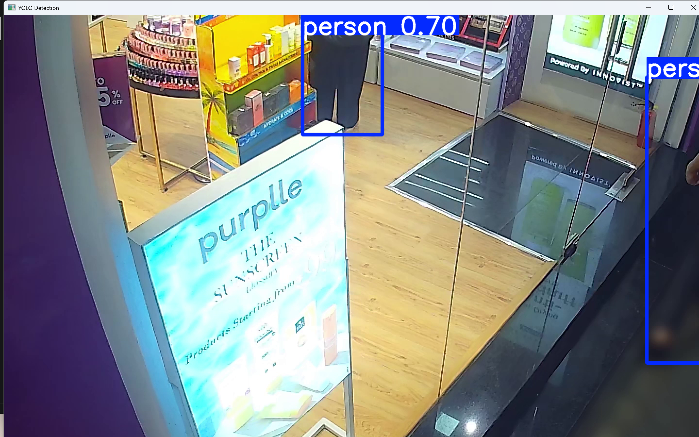
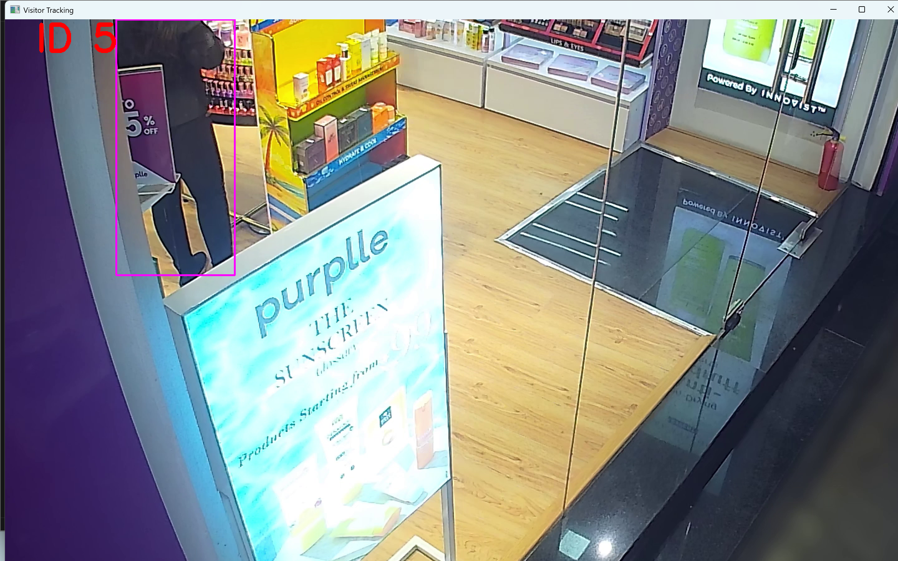
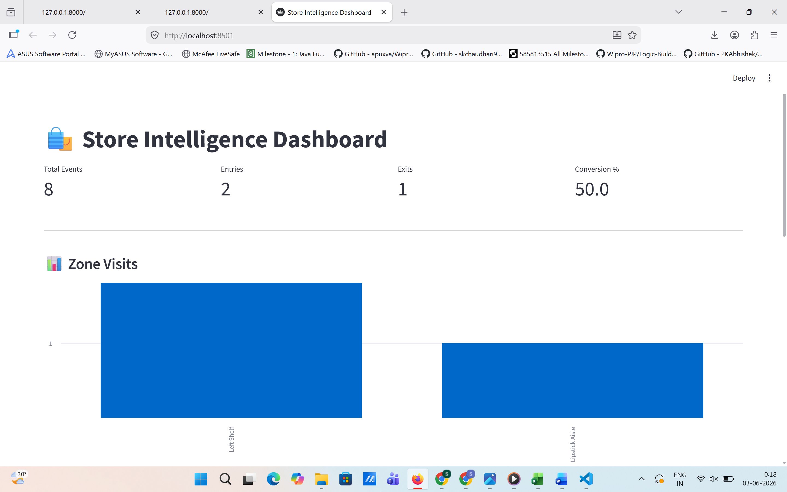
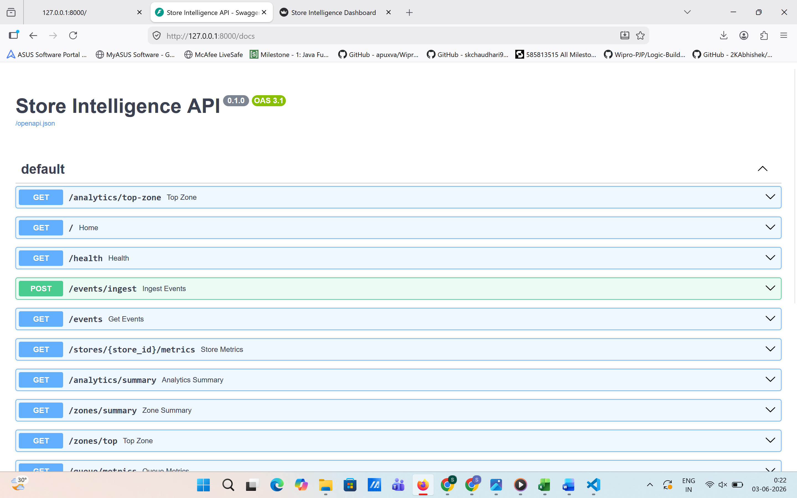

# Store Intelligence System

## Overview

AI-powered retail analytics platform that uses computer vision
to analyze customer movement, zone visits, queue performance,
and conversion metrics.

---

## Features

- Visitor Detection
- Visitor Tracking
- Entry / Exit Counting
- Zone Analytics
- Queue Analytics
- Heatmap Analytics
- FastAPI Backend
- Streamlit Dashboard

---

## Tech Stack

Python
YOLOv8
OpenCV
ByteTrack
FastAPI
Streamlit
Pandas

---

## Architecture

Video
↓
YOLO Detection
↓
ByteTrack
↓
Event Generation
↓
JSON Storage
↓
FastAPI
↓
Dashboard

---

## Run

### Install

pip install -r requirements.txt

### Start API

uvicorn app.main:app --reload

### Start Dashboard

streamlit run dashboard/dashboard.py

---

## APIs

GET /events

POST /events/ingest

GET /analytics/summary

GET /analytics/conversion

GET /analytics/top-zone

GET /analytics/queue

GET /analytics/heatmap

GET /stores/{store_id}/metrics

--- 

## Detection

## Tracking

## Dashboard

### Dashboard View 1

### Dashboard View 2

## API Docs

## Future Improvements

- Real-time Kafka Streaming
- PostgreSQL Storage
- Multi-store Support
- Live Camera Processing
- Alert Engine 